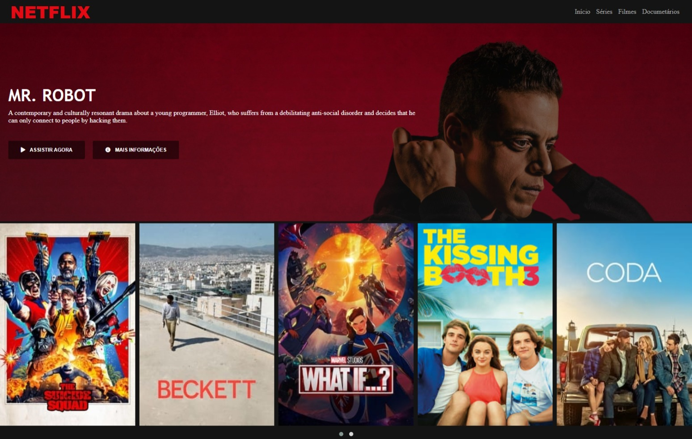

# Netflix interface clone

This project  was made at DIO (Digital Inovation One) bootcamp, in which we recreate the Netflix interface.

### About this project

This project was created in order to practice my skills with HTML and CSS.

## Tech Stack

## Link

https://netflix-interface-clone.vercel.app

  
## Demo

  
## Screenshots

#### Desktop view

  
## Author

- [David Nunes](https://www.github.com/Dnuns)
